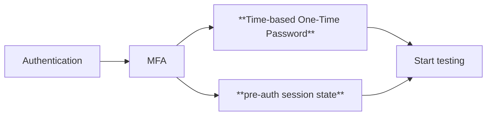

# Authentication

---
layout: image
image: .demo/assets/login-username.png
---

---
layout: default
---

# We can easily fix this

<br />
<br />

```ts
const emailInput = page.locator("input[type=email]");
await emailInput.click();
await emailInput.fill(userName);

await page.getByRole("button", { name: "Next" }).click();
```

---
layout: image
image: .demo/assets/login-password.png
---

---
layout: default
---

# Similarly for the password

<br />
<br />

```ts
const passwordInput = page.locator("input[type=password]");
await passwordInput.click();
await passwordInput.fill(password);
await page.locator("input[type=submit]").click();
```

---
layout: image
image: .demo/assets/login-authenticator.png
---

---
layout: section
---

# What now?

---
layout: section
---

# Turn it off! 🙈

---
layout: section
---

# Hire someone to manually authenticate 🤷‍♂️

---

# The options



<br />

> Reference: [Using an authenticated session state](https://www.eliostruyf.com/e2e-testing-mfa-environment-playwright-auth-session/)

---
layout: default
---

# What is an auth session state?

A file which contains:

- Cookies
- Local Storage
- Session Storage

This file can be loaded into a browser context to simulate an authenticated session.

```bash
npx playwright codegen engagetime.live --save-storage=auth.json
```

---
layout: section
---

# One-Time Password Authentication

---
layout: section
---

# 46 99 52

---
layout: default
---

# How does OTP work?

1. User sets up OTP in their account settings
2. User gets a **secret key**
3. The authenticator app uses this key to generate time-based codes
4. You get a 6-digit code every 30 seconds

---
layout: default
---


<dt-show clicks="1">

<dt-arrow
  x1="250"
  x2="365"
  y1="327"
  y2="327"
  line-color="#ff69b4"
  line-width="2">
</dt-arrow>

</dt-show>

<style>
  .slide__content__inner {
    display: flex;
    justify-content: center;
    align-items: center;
  }
  img {
    height: 350px;
    margin: auto;
  }
</style>

---
layout: default
---


<dt-show clicks="1">

<dt-arrow
  x1="250"
  x2="346"
  y1="408"
  y2="408"
  line-color="#ff69b4"
  line-width="2">
</dt-arrow>

</dt-show>

<style>
  .slide__content__inner {
    display: flex;
    justify-content: center;
    align-items: center;
  }
  img {
    height: 450px;
    margin: auto;
  }
</style>

---
layout: default
---

# All you need is a script

<br />
<br />

```ts
import * as OTPAuth from "otpauth";

const args = process.argv;

const totp = new OTPAuth.TOTP({
  issuer: "Microsoft",
  algorithm: "SHA1",
  digits: 6,
  period: 30,
  secret: args[2],
});

console.log(`OTP Code: ${totp.generate()}`);
```

---
layout: section
---

# Let's see it in action!
